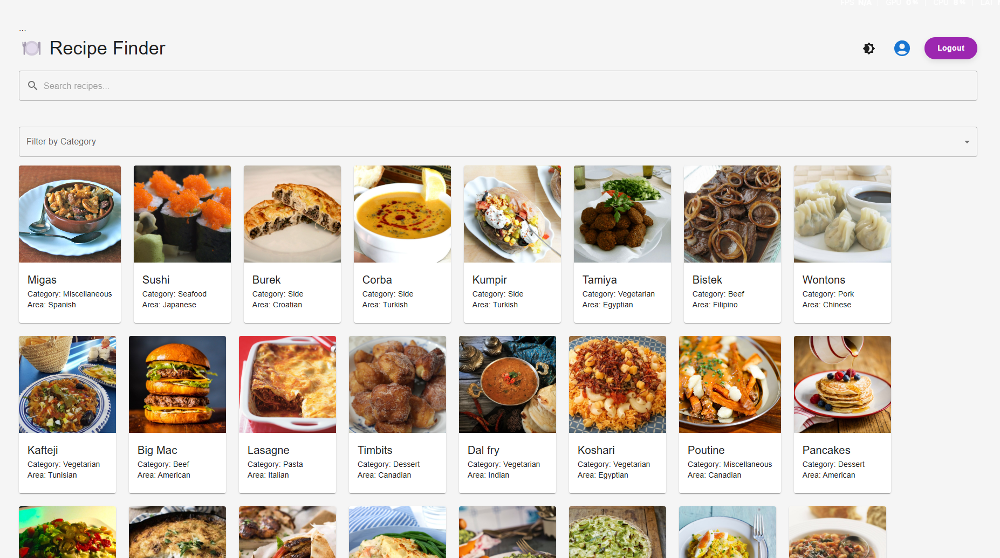

# 🍽️ Recipe Finder

A modern, responsive Recipe Finder web app built with **React** and **TypeScript**. Search meals, view details, save your favorites, and even **add your own custom recipes** — all with beautiful light/dark themes and smooth user experience.

---

## ✨ Features

- 🔍 **Search recipes** from [TheMealDB API](https://www.themealdb.com/)
- 🔖 **Save your favorite meals** with localStorage
- 🌙 **Light & Dark mode** toggle with smooth UI
- ➕ **Add your own recipes** (if user is logged in)
- 🔐 Simple localStorage-based authentication
- 📱 **Responsive design** with **Tailwind CSS**
- ⚛️ Built using **React + TypeScript**
- 🤖 AI is used to built this like Chatgpt and Deepseek

---

## 🎥 Demo Video

📽️ A short video demo is available inside the project at:  
`src/assets/0407(2)4.mp4`

> You can open the video manually to view a walkthrough of the app functionality.

---

## 📸 Screenshots

### 🌑 Dark Mode  


### ☀️ Light Mode  


---

## 📦 Installation

Clone the repository and install all dependencies:

```bash
npm install
